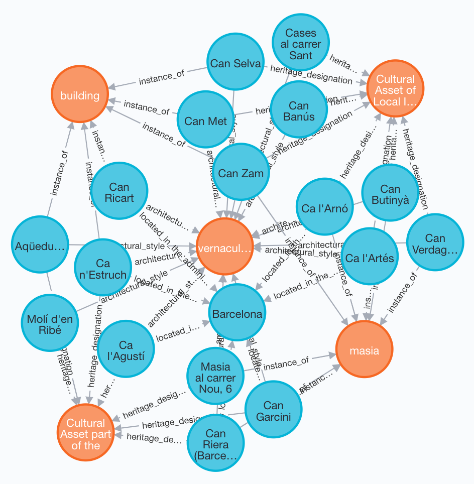
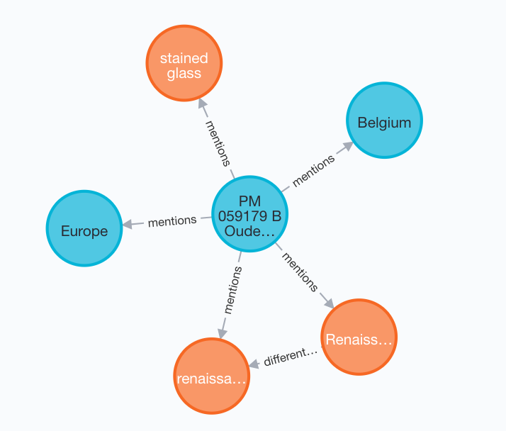

# MEMEX Project: Knowledge Graph
Abstract:
The MEMEX-KG creates a Geolocalised Cultural Heritage Knowledge Graph for exploitation within the MEMEX Project. Currently it provides tools for ingestion from 3rd Party Sources - Wikidata (https://www.wikidata.org/), Europeana(https://www.europeana.eu/), Mapillary (http://Mapillary.com) and a Custom Form  (powered by Wikidata categories and google Forms); to construct a graph rooted in the pilot areas. The MEMEX-KG focuses on tangible objects that can be localised and connects to intangible content collected and created across the project duration. 

Authors: \
Hebatallah Mohamed, Ca'Foscari University of Venice \
Sebastiano Vascon, Ca'Foscari University of Venice \
Diego Pilutti, Ca'Foscari University of Venice \
Feliks Hibraj, Ca'Foscari University of Venice \
Stuart James, Istituto Italiano di Tecnologia 


## Installation
1. Install the latest version of Neo4j (4.0+)
	- Download the latest version of Neo4j at https://neo4j.com/download/
	- Run the downloaded file, installation process follows
1. (Alternative) Set up a Neo4j sandbox:
	- Visit https://sandbox.neo4j.com/
	- Login
	- Click on "Start a new project", choose the "Blank Project" and confirm by pressing "Launch the project"
	- Now you have a neo4j sandbox project, which you can access with credentials found in "Connection details",
	in particular, use "Bolt URL" as the field "uri" in file credentials.txt, use "Username" and "Password" for the
	remaining 2 fields of file credentials.txt.
2. Install the APOC plugin of Neo4j. 	
3. Install the dependencies listed in the the requirements.txt
```
pip3 install -r requirements.txt
```

## Config
Edit the file "config.py" adding the credentials and keys for the various services (please note you only need keys for the services you intend to ingest)
Example
```
neo4j = {
    "uri":"bolt://127.0.0.1:7687",
    "username": "user",
    "password":"pass",
    "encrypted": False
}

europeana = {
    "europeana-token":"key",
    "tagme-token":"key",
    "data_dir": "data/europeana/"
}

```

For Neo4j the config correspond to:
- uri: Neo4j Instance address
- username: Username for Neo4j
- password: Password for Neo4j
(See Neo4j docuemntation for setting up Neo4j)

Additional configuration details are inlined in the relevant sections below.

## Knowledge Graph Ingestion
For detailed usage help run:
```
python main.py -h 
```

To clear the Neo4j Knowledge Graph run:
```
python main.py  --mode 5
```

Below we outline example configuration settings and commands for the respective sources. 


## Wikidata

Wikidata Ingestion Example Command:
```
python main.py  --mode 0 --city barcelona --hops 2
```
The following figure shows part of the ingested KG, where the orange nodes represent entites of type "Knowledge" and the cyan ones are of type "Place".




## Europeana
Europeana Settings: [in config.py]:
- europeana_token: Requested from Europeana API
- tagme_token: Requested from TagMe API
- data_dir": Store of json files and images from Europeana

Europeana Ingestion Example Command:
```
python main.py  --mode 2 --city barcelona
```

In order to link Europeana entities with the already ingested Wikidata entities, during the crawling process, you should add --link_to_nodes True: 
```
python main.py  --mode 2 --city barcelona --link_to_nodes True
```

The linking is performed by tagging the descriptions in Europeana entities using TagMe API (https://sobigdata.d4science.org/web/tagme/tagme-help), then relating the tags with the wikidata entites in the KG, by adding a new relation called "mentions".



## Integrating Wikipedia Descriptions and Embeddings
It is possible to integrate short descriptions from Wikipedia and the corresponding semantic embeddings in the KG.
First, download the Word2Vec model needed for the KG search functionality, and place it under the "models" folder.
```
wget http://magnitude.plasticity.ai/word2vec/light/GoogleNews-vectors-negative300.magnitude
```

Integrating Wikipedia Descriptions Example Command:
```
python main.py  --mode 7 --lang "en" --overwrite_embedding True
```
This instruction needs to be run after the ingestion of wikidata or europeana. Inserting this information enables for effective and efficient retrieval of nodes in the KG based on sentence similarity.

**Parameters**

* **--lang** : string corresponding to language of the description to be ingested, default "en"
* **--overwrite_embedding** : boolean selecting whether to overwrite descriptions and embeddings on the Knowledge Graph if already present, default True


## KG Search

Before starting with the KG Search, you should first execute the following command to generate the full-text indexing:
```
python main.py  --mode 9
```

then you have to enable the Graph Data Science (GDS) and the APOC Libraries.

GDS is mandatory to enable the semantic search.

KG Search Example Command:
```
python main.py  --mode 8 --lat 41.403706 --long 2.174347 --k 10 --query "modern art and sagrada familia" --meters 5000
```
Running this command performs a search in the knowledge graph starting from localisation data (--lat --long) and/or free text input (--query), which retrieve the top-K nodes in the KG ranked according to sentence similarity and distance (within the radial distance of --meters from the initial point). 

If the free text parameter is not provided, the command returns the top-K nodes according to distance proximity. 

If the localisation data is not provided but free text is given as an input, the output will be the top-K nodes according to similarities between the input text and the descriptions of the nodes in the KG.

Note: to correctly deploy the above functionalities, textual descriptions and embeddings should be already present in the KG. (see mode 7)

**Parameters**

* **--lat** : float corresponding to latitude coordinates
* **--long** : float corresponding to longitude coordinates
* **--k** : int corresponding to the top-K elements to be retrieved, default k=10
* **--query** : string corresponding to free text given in input
* **--meters** : integer corresponding to the radial distance from the intial point within which to consider the nodes, default 5000
* **--search_mode** : string "semantic" or "fulltext", default search_mode="fulltext"


## Tested on 
 - Ubuntu 18.04 LTS
 - Sandbox Neo4j 3.5.11, Neo4j 4.1.0 (Desktop Version),  Neo4j 4.1.0 (community edition), 
 - Python 3.6.10

## Acknowledgments
The MEMEX project has received funding from the European Union's Horizon 2020 research and innovation programme under grant agreement No 870743.
